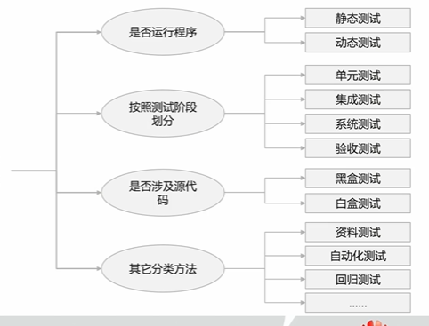

##### 软件测试，描述一种用来促进鉴定软件的正确性、完整性、安全性和质量的过程
软件测试是一个包含计划准备和测量活动的过程，旨在确认被测系统的特性并指出需求和实现之间的差异。软件测试是一个促进鉴定软件的正确性、完整性、安全性和质量的过程。

##### 软件缺陷：
从产品内部看，是软件产品开发或维护过程中所存在的错误和毛病等各种问题
从产品外部看，是系统所要实现的某种功能的失效或违背

功能特性没有实现或部分实现
需求设计不合理
运行出错，包括运行中断、系统崩溃、界面混乱等
数据结果不正确、精度不够等
用户不能接受的其他问题，eg.界面不美观

缺陷==不可避免==

##### 软件测试的对象:
软件测试不仅限于软件程序的测试，测试活动贯穿与软件开发的整个周期中。因此，需求分析、概要设计、详细设计以及编码各阶段所得到的交付件，包括设计文档、源代码、应用程序乃至随软件版本发布的资料，都是软件测试的对象。

##### 软件质量属性：
人们通常把影响软件质量的特性称为软件质量属性，用质量模型来描述，并定义为分层模型，最基本的叫做基本质量特性，它可以由一些子质量特性定义和度量
eg.业界软件质量属性的几种模型：
ISO 25010质量模型
McCall质量模型
NIST质量模型

不同模型主要在分类、属性上有所不同，单都包含一些主要的特性，包括：
- 安全性
- 可靠性
- 性能及效率
- 可用性
- 可维护性
- 兼容性等

##### 原则：
1. 测试显示缺陷的存在：测试可以显示缺陷的存在，但是不能证明系统不存在缺陷
2. 穷尽测试是不可能的
3. 测试尽早介入：在开发过程中越晚的修正缺陷，代价也就会越高
4. 缺陷集群性：一个经典的二八法则是80%的社会财富集中在20%的人手里
5. 杀虫剂悖论
6. 测试活动依赖于测试内容
7. "Abesence-of-errors"谬误：系统的发布不能取决于是否存在缺陷，而是取决于是否满足客户的需要和期望

##### 分类：

静态测试：通过手工检查（评审）或自动化分析（静态分析）的方式对代码或者其他的项目文档进行检查
动态测试：实际运行被测程序，输入相应的测试用例，判定执行结果是否符合要求，从而检验程序的正确性、可靠性、和有效性
* 动态测试有两种主要方法：
黑盒测试：根据功能和接口设计测试用例
白盒测试：根据内部实现和结构设计测试用例
**共同目标：识别缺陷**

单元测试：对软件中的最小可测试单元进行检查和验证
集成测试：把若干个经过单元测试的组件/模块/单元组装到一起
系统测试：把已经确认的软件、硬件、外设、网络等元素结合在一起，进行各种组装测试和确认测试
验收测试：由用户、客户、系统的其他利益相关者，进行的确认是否可以接受一个系统的验证性测试

白盒测试：根据被测对象的内部结构，设计测试用例的一种测试方法，又称为结构测试
黑盒测试：把测试对象看作一个黑盒子，测试人员不需要参考组件或系统的内部结构，依据客户的需求和规格说明书等，检查程序的功能是否符合它的功能说明。又被称为功能测试/数据驱动测试

资料测试：对产品资料的有效性、使用率和用户主管满意度进行测试
自动化测试：通过软件来模拟人的行为，替代人的测试执行工作
回归测试：指修改了旧代码后，重新进行测试以确认没有引入新的错误或导致其他代码产生错误

##### 测试方法设计：
**黑盒测试设计方法：**
- 等价类覆盖：
  针对系统功能的输入按照不同的原则划分为不同的等价类，等价类中选取任意的数据对系统功能的影响是相同的，通过对多个等价类中有代表性的数据的覆盖达到对该测试输入的覆盖
  有效等价类：
  指对于系统的规格来说是合理的，有意的输入数据构成的集合
  无效等价类:
  指对于系统的规格来说是不合理或无意义的输入数据构成的集合

- 边界值分析：
  边界值分析是假定大多数的错误发生在各种输入条件的边界上，如果在边界附近的取值不会导致程序出错，那么其他的取值导致程序错误的可能性也较小
  对输入或输出的边界值进行测试的一种测试方法。边界值分析是在划分的等价类区域的边界及其附近进行测试数据的选取
    1. 确定输入方法
    2. 生成测试用例
    3. 测试项整合（可选）

**白盒测试设计方法：**
- 语句覆盖
- 判定覆盖（分支覆盖）
- 条件覆盖
- 判定/条件覆盖
- 路径覆盖